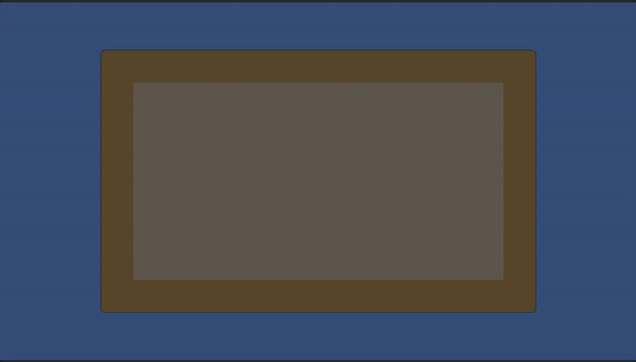

# Core Systems



## Overview

Core Systems is a Unity package implementing a robust architecture for game development using the Model-View-Presenter (MVP) pattern. It provides a structured approach for building maintainable and testable game systems.

## Current Implementation

### Architecture

The project currently follows a clean MVP architecture:

- **Models**: Data containers and business logic 
- **Views**: UI representation and user interaction
- **Presenters**: Mediators connecting models and views

### Implemented Systems

#### Core Framework
- Base classes (`BasePresenter`, `BaseView`, `IModel`)
- Dependency injection using VContainer
- Presenter staggering system
- Application bootstrapping

#### Inventory System
- `InventoryModel`: Manages inventory data and server communication
- `InventoryPresenter`: Coordinates between model and view
- `InventoryView`: Displays inventory items with animations

#### Save/Load System
- `SaveSystem`: Handles saving and loading game data
- JSON serialization/deserialization
- Asynchronous file operations
- Error handling

### Testing
- Unit tests for the Save/Load system
- Test fixtures and assertions

### Dependencies
- UniTask for async/await patterns
- DOTween for animations
- Addressables for asset management
- VContainer for dependency injection

## Roadmap

### Short-term Goals
- [ ] Complete UI system with more components
- [ ] Add event system for cross-component communication
- [ ] Implement player progression system
- [ ] Create resource management system

### Mid-term Goals
- [ ] Add cloud save functionality
- [ ] Implement analytics integration
- [ ] Create achievement system
- [ ] Build scene management and transitions

### Long-term Goals
- [ ] Plugin system for extensibility
- [ ] Visual scripting integration
- [ ] Performance optimization and profiling tools
- [ ] Multi-platform deployment support

## Getting Started

### Installation

1. Add the package to your Unity project via the Package Manager:
   ```
   {
       "dependencies": {
           "com.company.coresystems": "1.0.0"
       }
   }
   ```

2. Configure the Core Systems in your scene:
   - Add a `CoreSystemLifetimeScope` component to your scene
   - Configure required references
   - Run the scene to initialize the systems

### Basic Usage

```csharp
// Creating a new system following the MVP pattern
public class MyModel : IModel {
    // Model implementation
}

public class MyView : BaseView {
    // View implementation
}

public class MyPresenter : BasePresenter<MyModel, MyView> {
    // Presenter implementation
}

// Register in your LifetimeScope
protected override void Configure(IContainerBuilder builder)
{
    // Register your system components
    builder.Register<MyModel>(Lifetime.Transient);
    builder.RegisterComponentInNewPrefab(myViewPrefab, Lifetime.Transient);
    builder.Register<MyPresenter>(Lifetime.Transient);
}
```

## Contributing

Please follow the established coding patterns when contributing to this project. Ensure all new systems:
1. Follow the MVP pattern
2. Include proper unit tests
3. Use async/await patterns with UniTask
4. Handle errors and edge cases appropriately